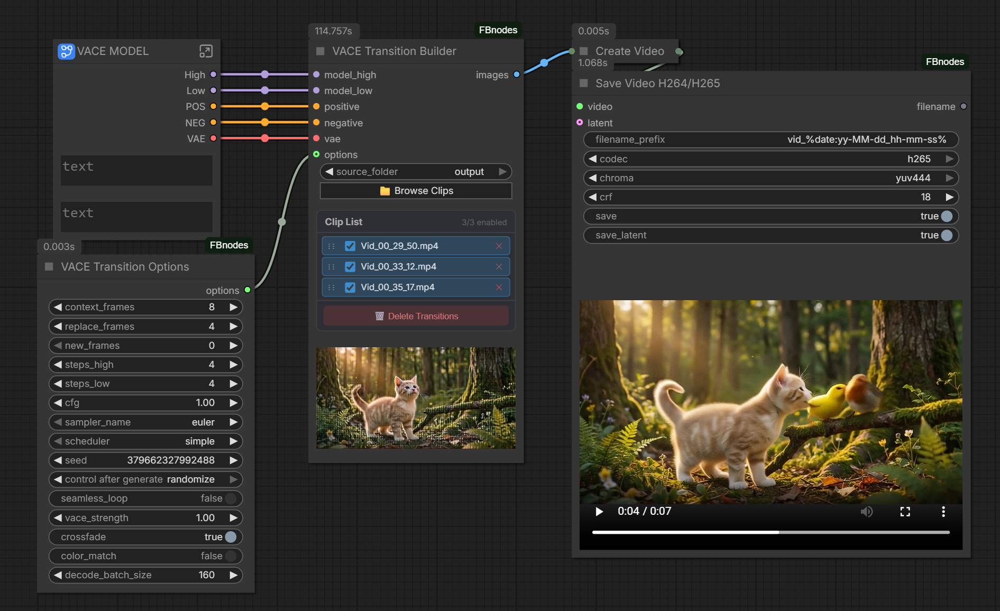

# ComfyUI-FBnodes

A grab bag of handy ComfyUI nodes I built for my own workflows and figured someone else might enjoy too. Video saving, universal switches, LoRA helpers, animated latent previews, Crop tool and whatever else I end up needing next.

## Nodes

### Save Video+
Save video with H.264 or H.265 (HEVC) codec and quality control. Includes audio muxing and workflow metadata embedding.
If yuv444 is selected, will generate a preview clip, so it can still be seen in browser. (Saved in temp)

- **Codec**: H.264 (8-bit, max compatibility) or H.265/HEVC (10-bit, better compression)
- **Chroma**: yuv420 / yuv422 / yuv444
- **CRF**: Constant Rate Factor quality control (0=lossless, 18-23=high quality)
- **Preview mode**: Toggle save off for fast preview-only encoding
- **Latent saving**: Optionally save the latent alongside the video for easy re-generation

### Load Image+:
- **Image/Video Screenshot Loading**: Image loader, based on Prompt Extractor from [Prompt Manager](https://github.com/FranckyB/ComfyUI-Prompt-Manager)
- **Input/Output Folder Switching**: Toggle between browsing your input or output folder directly from the node
- **File Browser**: Same thumbnail browser as Prompt Extractor with subfolder navigation
- **Video Frame Scrubbing**: Load any frame from a video using the frame position slider
- **Drag-and-Drop Support**: Drop images or videos directly onto the node
- **Image Preview**: Built-in preview with click-to-enlarge modal for images and videos
- **Mask Editor Support**: Right-click to open ComfyUI's MaskEditor, painted masks are displayed in the preview
- **IMAGE + MASK Output**: Outputs both IMAGE and MASK tensors, with alpha channel extraction from images

### Load Video+
Video loader with the same file browser and UX as Load Image+, but for videos. Outputs a VIDEO type for use with **Get Video Components+**.

- **Input/Output Folder Switching**: Toggle between browsing your input or output folder
- **File Browser**: Thumbnail browser with video-first filtering and subfolder navigation
- **Video Preview**: Click-to-enlarge modal with playback controls
- **Drag-and-Drop Support**: Drop video files directly onto the node
- **VIDEO Output**: Outputs a VIDEO, ready to pipe into Get Video Components+

### LTX Review
Review gate node for 2-pass LTX-style workflows. It pauses execution, decodes video/audio latents internally, opens a review popup with playback, and continues only when you proceed (or timeout policy allows it).

- **Inputs**: `video_latent`, `audio_latent`, `video_vae`, `audio_vae`, `fps`, `timeout`, `on_timeout`, `enable` (+ optional `preview_video`)
- **Popup controls**: Proceed, Cancel, Requeue
- **Audio + video playback**: Always generates a browser-compatible H.264/yuv420 preview in temp from decoded latents
- **Timeout behavior**: Auto-proceeds or auto-cancels based on `on_timeout`
- **Enable switch**: When OFF, passes through latents immediately and skips both VAE decodes/review popup
- **Preview passthrough when disabled**: Optional `preview_video` preserves `review_path` output for preview workflows without running decode
- **Outputs**: `video_latent`, `audio_latent`, `review_path`
- **review_path**: Path to the generated temp preview clip

### LTX Review Preview
Minimal companion preview node for displaying a video from a path, useful with `LTX Review`'s `review_path` output.

- **Input**: `review_path` (supports absolute paths and optional `[input]/[output]/[temp]` annotations)
- **Behavior**: Resolves the path and displays the video preview when executed
- **No pass-through outputs**: This node is display-only

### Load Checkpoint+
Checkpoint loader with a searchable, grouped dropdown designed for large model libraries.

- **Text filter**: Supports comma-separated terms (example: `sdxl, anime`)
- **AND matching**: All typed terms must match in model name or path
- **Grouped list UI**: Displays a flat list with section headers (example: `----Anime----`)
- **Clean labels**: Hides common extensions in the dropdown display (`.safetensors`, `.ckpt`, `.pt`, `.bin`, `.pth`)
- **Safe header selection**: Selecting a section header auto-selects the first model in that section
- **Real path output**: Node still passes the real Comfy model path internally
- **Outputs**: `MODEL`, `CLIP`, `VAE`, `ckpt_name` (COMBO)

### Load Diffusion Model+
Diffusion/UNET loader with the same searchable grouped dropdown UX as Load Checkpoint+.

- **Text filter**: Supports comma-separated terms (example: `flux, fp8, wan, low`)
- **AND matching**: All typed terms must match in model name or path
- **Grouped list UI**: Displays a flat list with section headers (example: `----Wan22----`)
- **Clean labels**: Hides common extensions in the dropdown display (`.safetensors`, `.ckpt`, `.pt`, `.bin`, `.pth`)
- **Safe header selection**: Selecting a section header auto-selects the first model in that section
- **Real path output**: Node still passes the real Comfy model path internally
- **Outputs**: `MODEL`, `unet_name` (COMBO)

### Crop Image+
Interactive crop node with draggable crop box, optional aspect-ratio lock, and live preview.

- **Interactive crop UI**: Drag the crop box and handles directly in-node
- **Aspect ratio lock**: Includes ratio presets with landscape toggle
- **Auto reset on new image**: New input image resets crop to full frame and ratio to `None`
- **Dual output**: Crops both IMAGE and MASK outputs together

### VACE Stitcher
Generate smooth AI-powered transitions between video clips using VACE conditioning and 2-stage sampling with a single node featuring a built-in clip browser, drag-to-reorder list, and cached .latent transitions for resumability.

- **File browser modal**: Browse input/output folders, multi-select clips, subfolder navigation
- **Reorderable clip list**: Drag-to-reorder, enable/disable individual clips, hover thumbnails
- **2-stage sampling**: High-noise + low-noise models for quality transitions
- **Pixel-space stitching**: Crossfade with easing curves, optional color matching
- **Lossless latent support**: Load `.latent` clips directly — skips lossy video decode, with memory-efficient on-demand decoding
- **Cached transitions**: Transitions cached as lossless `.latent` files — skip already-generated pairs on re-run
- **Options node**: Connect a separate "VACE Stitcher Options" node to tune all parameters, or use sensible defaults

Inspired by [__Bob__](https://civitai.com/user/__Bob__)'s [Wan VACE Clip Joiner workflow](https://civitai.com/models/2024299/wan-vace-clip-joiner-smooth-ai-video-transitions-for-wan-ltx-2-hunyuan-and-any-other-video-source) on CivitAI.

[](docs/vace_stitcher.png)

<details>
<summary><strong>How to use VACE Stitcher</strong></summary>

An example workflow can be found ....  If starting from scratch here are some basic instructions.

#### Required Models

You need **both** the high-noise and low-noise Wan 2.2 VACE models. Choose one format:

**bf16 or fp8** (from Comfy-Org):
- [`wan2.2_vace_i2v_high_noise_14B-*.safetensors`](https://huggingface.co/Comfy-Org/Wan_2.2_ComfyUI_Repackaged/tree/main/split_files/diffusion_models)

or **GGUF** (from QuantStack):
- [`Wan2.2-VACE-Fun-A14B-*.gguf`](https://huggingface.co/QuantStack/Wan2.2-VACE-Fun-A14B-GGUF/tree/main) (high + low noise variants)

Place models in `/models/diffusion_models/` or `/models/unet` if GGUF

#### Tips

- Use a Wan 2.2 i2v‑distilled LoRA to lower the required step count.
- **Lossless clips**: Save your source clips with **Save Video+** using the "Save Latent" option. VACE Stitcher will automatically detect and use the `.latent` file for lossless quality — no video decode needed. A magenta dot in the clip list indicates which clips have a latent available. For now only Wan latents are supported.
- **First run** generates and caches all transitions. Subsequent runs skip cached pairs.
- **Delete Transitions** clears the cache so you can regenerate with different settings.
- Without an **Options** node connected, the seed is random each run — just delete transitions and re-queue for a new result.
- Connect a **VACE Stitcher Options** node to control context/replace frames, steps, sampler, crossfade, color matching, and more.
- Disable clips in the list (uncheck) to skip them without removing.

</details>

### Load Latent File
Load a `.latent` file saved by Save Video+. Companion node for video+latent workflows.

### Get Video Components+
Memory-efficient video inspector/extractor for VIDEO inputs.

- Metadata-first by default (does not decode frames/audio/latent unless those outputs are connected)
- Internal chunked frame decoding uses a fixed chunk size of 128 to reduce memory needs.
- Outputs: `images`, `audio`, `fps`, `filepath`, `latent`, `width`, `height`, `frame_count`, `duration`
- Automatically loads matching `.latent` file if one exists beside the video

### Audio Mono to Stereo
Convert mono audio to stereo by duplicating the channel. Useful for video models that output mono audio.

### Switch Any
Universal switch with up to 10 named inputs. True lazy evaluation — only the selected input is evaluated. Other inputs are completely ignored by ComfyUI, with zero performance cost from inactive branches.

- Custom names via comma/semicolon-separated list
- Dynamic input count (1-10)
- Names display on input slots

### Switch Any (Boolean)
Boolean switch — passes through `on_true` or `on_false` based on a condition toggle. Only the active branch is evaluated.

### Apply LoRA+
Apply a LORA_STACK (list of LoRA tuples) to a model and optional CLIP. Works with Prompt Manager Advanced's LoRA stack output.

### LoRA List+
Build a reorderable, toggleable list of LoRAs for quick testing workflows.

- Browse folders and add `.safetensors` files from disk
- Enable/disable individual LoRAs and drag to reorder
- Outputs enabled entries as newline-separated full paths
- Also outputs `basenames` (filename-only, extension removed), one per line

### Show as Text
Display any input as text in-node, with values persisted in the workflow.

- Accepts any input type (`*`) and converts values to string internally
- Useful for inspecting intermediate values without extra conversion nodes
- Persists displayed text across workflow reloads and tab switching

## Missing Model Remap Tool
Adds a top-bar button in ComfyUI: **Remap Missing Models**.

When clicked, it scans the current graph and tries to remap missing model-like widget values.

Matching order:
1. Exact basename match (case-insensitive)
2. Precision-token equivalent fallback (fp8/fp16/bf16)
3. Version variations (v1.1, v1_2, v2)

Example:
- workflow value: `wan21.safetensors`
- local file exists as: `wan/wan21.safetensors`
- tool remaps node widget to: `wan/wan21.safetensors`

Supported categories in v1:
- checkpoints/unet
- loras
- text encoders/clip
- vae (including audio-vae related widget keys)
- controlnet
- upscale models (including latent upscale related widget keys)
- Power Lora Loader (rgthree)

Rules and limits:
- Exact filename match first (case-insensitive)
- If exact fails, tries precision-token equivalents (fp8/fp16/bf16)
- If duplicate basenames exist in a category, result is marked ambiguous and skipped
- Updates only the current in-memory graph (no workflow file overwrite)
- Rejects unsafe values (absolute paths or traversal-like paths)

## Animated Latent Preview
Provides animated video previews during KSampler execution for video models (Wan, HunyuanVideo, Mochi, LTXV, Cosmos). Compatible with VideoHelperSuite — automatically defers if VHS is installed.

Enable in ComfyUI Settings: **FBnodes > Video Sampling > Animated Latent Preview**

## Installation

### ComfyUI Manager
Search for "ComfyUI-FBnodes" in ComfyUI Manager.

### Manual
```bash
cd ComfyUI/custom_nodes
git clone https://github.com/FranckyB/ComfyUI-FBnodes.git
pip install -r ComfyUI-FBnodes/requirements.txt
```

## Requirements
- `av` (PyAV) — for video encoding

## License
GPL-3.0

## Changelog

### version 1.4.0
- **Load Model+**: Added Load Checkpoint, Diffusion model and LoRA with filtering system.  Allowing, for example, to display only SDXL models.
- **Bug Fixes**: Multiple big fixes added over time.  Including an issue with VACE Stitcher that would fail if clip size wasn't divisible by 32

### version 1.3.1
- **LoRA List+**: Utility node for testing LoRAs, allows adding LoRAs to a list from anywhere on disk. Used with Outputlists-Combiner

### version 1.3.0
- **Crop Image+**: Added a new interactive crop node.

### version 1.2.00
- **Repath Models**  Added a new repath utility.  Allowing for 1 click repathing of all models and loras.  Uses minimal fuzzy logic to find models with different quantizations or versions.
- **Show as Text**  Added a simple Show Text node, that unlike Preview  as Text, is saved with Workflow and is maintained when switching tabs.

### version 1.1.12
- **Load Audio+**: Added a load audio node, similar to other loaders.  Has the ability to trim the In and Out point.
- **Polish**:  Tweaked the UIs of Load Image+ and Load Video+, matching tweaks that were done to Load Audio+

### version 1.1.11
- **Apply LoRA+**: Added a simple "apply LoRA Stack" node, with a strength multiplier

### version 1.1.10
- **Load Image+ Mask Support**: Added MASK output with alpha channel extraction from images
- **Mask Editor Integration**: MaskEditor now works correctly — painted masks display in the node preview with transparency
- **Fix**: Handle MaskEditor's annotated filepath format (`file.png [input]`) so masked images load properly

### version 1.1.9
- **Renamed nodes**: cleaned up internal node IDs (`SaveVideoH26x` → `SaveVideoPlus`, `PromptApplyLora` → `ApplyLoraPlus`, `BetterImageLoader` → `LoadImagePlus`). Existing workflows will use "Legacy" versions for backward compatibility.
- **Fix Save Video+ display issues**: Fixed issues found in Load Video+.

### version 1.1.8
- **Speed Improvement**: Thumbnail generation now uses server-side PyAV instead of browser-based video decoding — substantially faster, especially with many clips.
- **Improved Handling of H265 Clips**
- **Renamed nodes**: Save Video H264/H265 → **Save Video+**, Better Image Loader → **Load Image+**. Existing workflows are unaffected.
- **New node**: Added **Load Video+** — video loader with file browser, preview, and drag-drop. Outputs VIDEO for Get Video Components+.

### version 1.1.5
- **VACE Stitcher**: Added lossless `.latent` file support for clips and transitions
  - Clips with a `.latent` file alongside are loaded in latent space, avoiding lossy video decode
  - Transitions now cached as `.latent` files instead of h265 video — lossless quality
  - Memory-efficient on-demand decoding: only decode what's needed, when it's needed
  - Latent indicator (magenta dot) in clip list UI shows which clips have `.latent` files

### version 1.1.1
- Renamed node from "VACE Transition Builder" to **VACE Stitcher**
- Added Workflow example.

### version 1.1.0
- Added **VACE Stitcher** node — generates smooth AI transitions between video clips using VACE conditioning
- Added **VACE Stitcher Options** node — optional parameter overrides for the stitcher
- Credit to [__Bob__](https://civitai.com/user/__Bob__) for the [original workflow](https://civitai.com/models/2024299/wan-vace-clip-joiner-smooth-ai-video-transitions-for-wan-ltx-2-hunyuan-and-any-other-video-source)

### version 1.0.0
- Initial release
- Transferred miscellaneous from [ComfyUI-Prompt-Manager](https://github.com/FranckyB/ComfyUI-Prompt-Manager) to keep it more focused.
